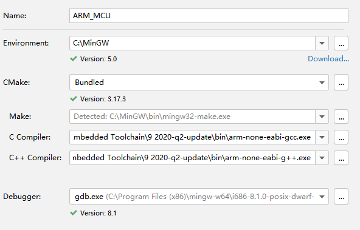
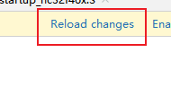
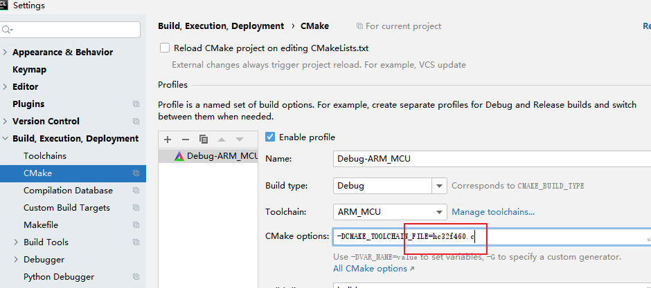
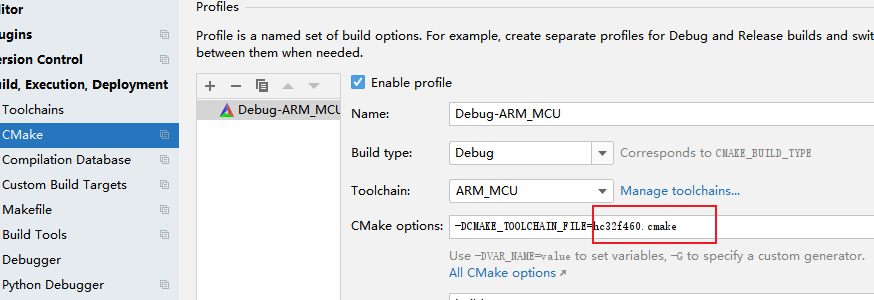

# Use Cmake on HC32F460 MCU
This tutorial is a sample of GPIO Output build with CMake.

## Toolchain
* MinGW 5.0
* CMake 3.17.3
* GNU Arm Embedded Toolchain 9 2020-q2-update

## IDE
JetBrain Clion 2020.3

## Worked feature
* Build
* Debug with Jlink
* Show the value of registers when debug.

## Know Issues
1. "Reload changes" of Cmake doesn't works properly. 
   
    We **can't reload** cmakeLists normally with click "Reload changes" directly after we changed CMakeLists.txt or *.cmake.
    
    
    
    The temporary solution is change the value of "CMake options"  in Settings of Clion. Then, we can change back to the correct value. 
    
    

2. Printf doesn't work properly.